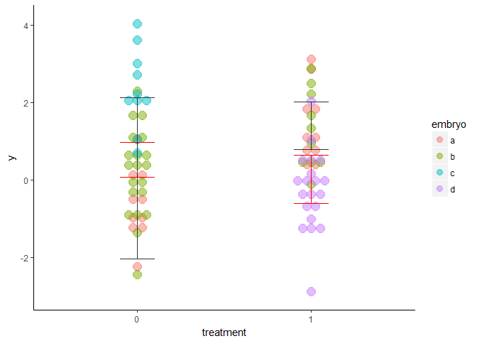

Pseudoreplication and mixed models
================
Bindoff, A.
4 August 2017

Pseudoreplication and mixed models
----------------------------------

We simulate a lab experiment that takes cells from four mouse embryos, and two mothers. Investigators are blinded, so some cells end up in an experimental group and others end up in a control group without the investigator having knowledge of which embryo or mother the cells came from. A measure `y` is observed for each cell (we don't know exactly what `y` is but it's continuous, and normally distributed).

``` r
mean.treatment.effect <- 1.5
sd.treatment <- sd.control <- 1
random.embryo.effect <- c(0, -1, 1, -0.5)
random.mother.effect <- 0

df <- data.frame(embryo = factor(c(rep("a", n*10),
                                   rep("b", n*15), rep("c", n*5), rep("d", n*10))),
                 mother = factor(c(rep(0, n*10), rep(1, n*20), rep(0, n*10))),
                 treatment = factor(c(rep(0, n*5), rep(1, n*10), rep(0, n*15), rep(1, n*10))),
                 ranef.em = c(rnorm(n*10, random.embryo.effect[1L], 0.1),
                               rnorm(n*15, random.embryo.effect[2L], 0.1),
                               rnorm(n*5,  random.embryo.effect[3L], 0.1),
                               rnorm(n*10, random.embryo.effect[4L], 0.1)),
                 ranef.mo = c(rnorm(n*10, random.mother.effect, 0.1),
                               rnorm(n*20, 0, 0.1),
                               rnorm(n*10, random.mother.effect, 0.1)))


y0 = c(rnorm(n*5, 0, sd.control),
      rnorm(n*10, mean.treatment.effect, sd.treatment),
      rnorm(n*15, 0, sd.control),
      rnorm(n*10, mean.treatment.effect, sd.treatment))

df$y <- y0 + df$ranef.em + df$ranef.mo

ggplot(df, aes(x = treatment, y = y, colour = embryo)) + 
  geom_boxplot() +
  facet_wrap(~mother)
```


``` r
xtabs(~ embryo + treatment, df)
```

    ##       treatment
    ## embryo  0  1
    ##      a 10 10
    ##      b 20 10
    ##      c 10  0
    ##      d  0 20

The first issue we can see is that cells from embryo `c` were allocated only to the control condition, and cells from embryo `d` were allocated only to the treatment condition so any effect of `treatment` might be confounded by `embryo` for these observations. If we consider only embryo `a` and `b`, we have an unbalanced design. Additionally, there is a strong random effect for embryos `b` and `c`. We're missing information about the `treatment` effect of `c` so this might affect our estimate of the random effect of embryo `c`.

Fortunately, we know what the 'true' effects of interest are, so all that remains is to specify our model correctly and see how good the resulting estimates are. Ignoring the true number of replicates and random effects, we fit a general linear model as if each observation is a true replicate -

    ## 
    ## Call:
    ## lm(formula = y ~ treatment, data = df)
    ## 
    ## Residuals:
    ##     Min      1Q  Median      3Q     Max 
    ## -3.2649 -0.8682 -0.0676  0.8259  2.9415 
    ## 
    ## Coefficients:
    ##             Estimate Std. Error t value Pr(>|t|)    
    ## (Intercept) -0.09926    0.20193  -0.492 0.624407    
    ## treatment1   1.06265    0.28558   3.721 0.000372 ***
    ## ---
    ## Signif. codes:  0 '***' 0.001 '**' 0.01 '*' 0.05 '.' 0.1 ' ' 1
    ## 
    ## Residual standard error: 1.277 on 78 degrees of freedom
    ## Multiple R-squared:  0.1508, Adjusted R-squared:  0.1399 
    ## F-statistic: 13.85 on 1 and 78 DF,  p-value: 0.0003725

The effect of treatment is estimated as -0.09926, 1.06265, and we know the 'true' treatment effect, 1.5 with zero intercept. The adjusted *R*<sup>2</sup> = 0.1398669, so we know that this is a poor explanatory model, and we can't trust the p-value because the summary tells us it was calculated using one source of error variance and more Degrees of Freedom than possible with the number of replicates we have.

A better model would recognise that we have just four replicates, and that most of our observations are only useful in estimating the within-embryo variance (or within-mother variance?). If we had a balanced design would could estimate this within-embryo variance using ANOVA, but that's not the case here. We can, however, use mixed models quite happily.

    ## Linear mixed model fit by REML ['merModLmerTest']
    ## Formula: y ~ treatment + (1 | mother/embryo)
    ##    Data: df
    ## REML criterion at convergence: 244.4218
    ## Random effects:
    ##  Groups        Name        Std.Dev. 
    ##  embryo:mother (Intercept) 9.254e-01
    ##  mother        (Intercept) 1.389e-07
    ##  Residual                  1.053e+00
    ## Number of obs: 80, groups:  embryo:mother, 4; mother, 2
    ## Fixed Effects:
    ## (Intercept)   treatment1  
    ##    -0.08081      1.45745

The estimated treatment effect is within an acceptable range. How well were the random effects estimated?

    ##      estimated true
    ## a:0  0.5770238  0.0
    ## b:1 -0.7925593 -1.0
    ## c:1  0.9342800  1.0
    ## d:0 -0.7187445 -0.5

    ##       estimated true
    ## 0 -3.192615e-15    0
    ## 1  3.192615e-15    0

The estimated random effects of `embryo` and `mother` are a reasonable representation of reality. Adding a true effect of `mother` -

``` r
random.mother.effect <- c(-0.9, 1)

df$ranef.mo <- c(rnorm(n*10, random.mother.effect[1L], 0.1),
                 rnorm(n*20, random.mother.effect[2L], 0.1),
                 rnorm(n*10, random.mother.effect[1L], 0.1))

df$y <- y0 + df$ranef.em + df$ranef.mo

ggplot(df, aes(x = treatment, y = y, colour = embryo)) + 
  geom_boxplot() +
  facet_wrap(~mother)
```


    ## Linear mixed model fit by REML ['merModLmerTest']
    ## Formula: y ~ treatment + (1 | mother/embryo)
    ##    Data: df
    ## REML criterion at convergence: 246.4979
    ## Random effects:
    ##  Groups        Name        Std.Dev.
    ##  embryo:mother (Intercept) 1.131   
    ##  mother        (Intercept) 1.207   
    ##  Residual                  1.052   
    ## Number of obs: 80, groups:  embryo:mother, 4; mother, 2
    ## Fixed Effects:
    ## (Intercept)   treatment1  
    ##     0.01265      1.43465

The treatment effect is close to the true treatment effect (see "Fixed Effects:" at the bottom of the summary). How well were the random effects estimated?

    ##      estimated true
    ## a:0  0.3128986  0.0
    ## b:1 -0.5988472 -1.0
    ## c:1  1.2165987  1.0
    ## d:0 -0.9306502 -0.5

    ##    estimated true
    ## 0 -0.7036494 -0.9
    ## 1  0.7036494  1.0

A question for the brave, why is the estimated random effect of `mother` symmetric? What implications does this have? *(Chapter 11 of "Data Analysis Using Regression and Multilevel/Hierarchical Models" (Gelman & Hill, 2007) discusses the issue of the minimum number of groups for a mixed model).*

Comparing the (definitely incorrect) ANOVA with the mixed effects model (in case you're wondering, we obtain p-values by loading the `lmerTest` package *before* fitting the model with `lmer`) -

``` r
anova(m1 <- lm(y ~ treatment, df))
```

    ## Analysis of Variance Table
    ## 
    ## Response: y
    ##           Df  Sum Sq Mean Sq F value Pr(>F)
    ## treatment  1   0.247 0.24746  0.1341 0.7152
    ## Residuals 78 143.956 1.84560

``` r
anova(m2)
```

    ## Analysis of Variance Table of type III  with  Satterthwaite 
    ## approximation for degrees of freedom
    ##           Sum Sq Mean Sq NumDF  DenDF F.value    Pr(>F)    
    ## treatment 24.498  24.498     1 77.241  22.154 1.086e-05 ***
    ## ---
    ## Signif. codes:  0 '***' 0.001 '**' 0.01 '*' 0.05 '.' 0.1 ' ' 1

We can see that using all of the available information can lead to better estimates, and more power to detect treatment effects. Further, we did not violate the assumption of independence or falsely inflate our p-value with pseudoreplication.

To compare our incorrectly specified general linear model (ANOVA with too many degrees of freedom) and our correctly specified mixed model, we predict a mean and confidence interval for each level of treatment using each model. However, in order to correctly incorporate model uncertainty in the mixed model, we will need to use a procedure known as "bootstrapping" - which requires us to draw many samples from the data (with replacement), making predictions from our model.

``` r
nsim = 500
df.new <- df

bootfit <- bootMer(m2, FUN=function(x) predict(x, df.new, re.form = NA),
                   nsim = nsim,
                   parallel = "multicore",
                   ncpus = 3L)

df.new$lwr.boot <- apply(bootfit$t, 2, quantile, 0.025)
df.new$upr.boot <- apply(bootfit$t, 2, quantile, 0.975)
df.new$y0 <- apply(bootfit$t, 2, mean)
prd <- predict(m1, interval = "confidence")
df.new <- cbind(df.new, data.frame(prd))
```



The effect of treatment predicted by bootstrapping is 1.42, which is remarkably close to the simulated treatment effect. Compare this to the treatment effect predicted by the general linear model, 0.11. The confidence interval estimated using the general linear model is excessively narrow, due to the large number of pseudoreplicates. This neatly highlights the issue of falsely drawing inference from an experiment with such a small number of replicates. Drawing samples from more embryos would give a better estimate of variability due to treatment within the *population*. In fact, although we did not show it here, drawing fewer samples from more replicates is better than more samples from fewer replicates in general.
