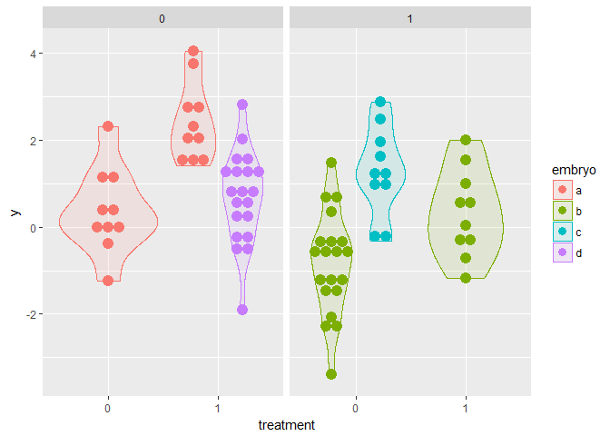
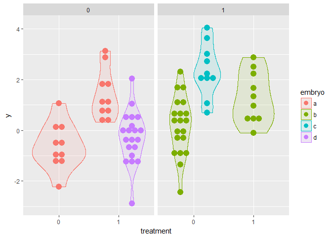

Pseudoreplication and mixed models
================
Bindoff, A.
4 August 2017

Pseudoreplication and mixed models
----------------------------------

We simulate a lab experiment that takes cells from four mouse embryos, and these embryos come from two mothers. Under blinded conditions, some cells have a treatment applied and the remainder serve as controls. The investigator has no knowledge of which embryo (or mother) the cells came from until after the experiment. `y` is the response variable, it is continuous and normally distributed.

``` r
mean.treatment.effect <- 1.5
sd.treatment <- sd.control <- 1
random.embryo.effect <- scale(c(0, -1, 1, -0.5))
random.mother.effect <- 0

df <- data.frame(embryo = factor(c(rep("a", n*10),
                                   rep("b", n*15), rep("c", n*5), rep("d", n*10))),
                 mother = factor(c(rep(0, n*10), rep(1, n*20), rep(0, n*10))),
                 treatment = factor(c(rep(0, n*5), rep(1, n*10), rep(0, n*15), rep(1, n*10))),
                 ranef.em = c(rnorm(n*10, random.embryo.effect[1L], 0.1),
                               rnorm(n*15, random.embryo.effect[2L], 0.1),
                               rnorm(n*5,  random.embryo.effect[3L], 0.1),
                               rnorm(n*10, random.embryo.effect[4L], 0.1)),
                 ranef.mo = c(rnorm(n*10, random.mother.effect, 0.1),
                               rnorm(n*20, 0, 0.1),
                               rnorm(n*10, random.mother.effect, 0.1)))


y0 = c(rnorm(n*5, 0, sd.control),
      rnorm(n*10, mean.treatment.effect, sd.treatment),
      rnorm(n*15, 0, sd.control),
      rnorm(n*10, mean.treatment.effect, sd.treatment))

df$y <- y0 + df$ranef.em + df$ranef.mo

ggplot(df, aes(x = treatment, y = y, colour = embryo)) + 
  geom_boxplot() +
  facet_wrap(~mother)
```



``` r
xtabs(~ embryo + treatment, df)
```

    ##       treatment
    ## embryo  0  1
    ##      a 10 10
    ##      b 20 10
    ##      c 10  0
    ##      d  0 20

The first issue we can see is that cells from embryo `c` were allocated only to the control condition, and cells from embryo `d` were allocated only to the treatment condition so any effect of `treatment` might be confounded by `embryo` for these observations (or perhaps the effect of `embryo` might be confounded by `treatment`?) If we consider only embryo `a` and `b`, we have an unbalanced design. Additionally, there is a strong effect for embryos `b` and `c`. We call this effect a 'random' effect because these embryos are drawn at random from the population, and we might want to estimate the *distribution* of `embryo` effects, rather than a 'fixed' effect (which we can control or choose).

Fortunately, we know what the 'true' effects of interest are, so it remains to specify our model correctly and see how good the resulting estimates are.

Ignoring the true number of replicates and random effects, we fit a general linear model as if each observation is a true replicate -

    ## 
    ## Call:
    ## lm(formula = y ~ treatment, data = df)
    ## 
    ## Residuals:
    ##     Min      1Q  Median      3Q     Max 
    ## -3.3932 -0.8896 -0.0616  0.9461  3.0271 
    ## 
    ## Coefficients:
    ##             Estimate Std. Error t value Pr(>|t|)   
    ## (Intercept) 0.004351   0.211830   0.021  0.98366   
    ## treatment1  1.019877   0.299572   3.404  0.00105 **
    ## ---
    ## Signif. codes:  0 '***' 0.001 '**' 0.01 '*' 0.05 '.' 0.1 ' ' 1
    ## 
    ## Residual standard error: 1.34 on 78 degrees of freedom
    ## Multiple R-squared:  0.1294, Adjusted R-squared:  0.1182 
    ## F-statistic: 11.59 on 1 and 78 DF,  p-value: 0.00105

The effect of treatment is estimated as 0.00435, 1.01988, and we know the 'true' treatment effect, 1.5 with zero intercept. We can't trust the p-value because the summary tells us it was calculated using one source of error variance and more Degrees of Freedom than possible with the number of replicates we have.

A better model would recognise that we have just four embryos, and that our many observations tell us a lot about within-embryo variance (or within-mother variance?), but much less about between-embryo variance. If we had a balanced design would could use information from all available sources of variance, with the correct degrees of freedom, with ANOVA - but that's not the case here. We can, however, use mixed models quite happily. A correctly specified mixed model will estimate random and fixed effects appropriately, recognising that observations from the same embryo are not independent.

    ## Linear mixed model fit by REML ['merModLmerTest']
    ## Formula: y ~ treatment + (1 | mother/embryo)
    ##    Data: df
    ## REML criterion at convergence: 245.2103
    ## Random effects:
    ##  Groups        Name        Std.Dev.
    ##  embryo:mother (Intercept) 1.068   
    ##  mother        (Intercept) 0.000   
    ##  Residual                  1.053   
    ## Number of obs: 80, groups:  embryo:mother, 4; mother, 2
    ## Fixed Effects:
    ## (Intercept)   treatment1  
    ##     0.04156      1.46691

The estimated treatment effect is within an acceptable range. How well were the random effects estimated?

    ##      estimated      true
    ## a:0  0.6042717  0.146385
    ## b:1 -0.9462955 -1.024695
    ## c:1  1.1394904  1.317465
    ## d:0 -0.7974665 -0.439155

    ##   estimated true
    ## 0         0    0
    ## 1         0    0

Adding a true effect of `mother` -

``` r
random.mother.effect <- c(-1, 1)

df$ranef.mo <- c(rnorm(n*10, random.mother.effect[1L], 0.1),
                 rnorm(n*20, random.mother.effect[2L], 0.1),
                 rnorm(n*10, random.mother.effect[1L], 0.1))

df$y <- y0 + df$ranef.em + df$ranef.mo

ggplot(df, aes(x = treatment, y = y, colour = embryo)) + 
  geom_boxplot() +
  facet_wrap(~mother)
```



    ## Linear mixed model fit by REML ['merModLmerTest']
    ## Formula: y ~ treatment + (1 | mother/embryo)
    ##    Data: df
    ## REML criterion at convergence: 247.1666
    ## Random effects:
    ##  Groups        Name        Std.Dev.
    ##  embryo:mother (Intercept) 1.304   
    ##  mother        (Intercept) 1.252   
    ##  Residual                  1.051   
    ## Number of obs: 80, groups:  embryo:mother, 4; mother, 2
    ## Fixed Effects:
    ## (Intercept)   treatment1  
    ##     0.08528      1.44300

The treatment effect is close to the true treatment effect (see "Fixed Effects:" at the bottom of the summary). Comparing the estimated random effects with the 'true' effects -

    ##      estimated      true
    ## a:0  0.2887799  0.146385
    ## b:1 -0.7031354 -1.024695
    ## c:1  1.4689098  1.317465
    ## d:0 -1.0545543 -0.439155

    ##    estimated true
    ## 0 -0.7058169   -1
    ## 1  0.7058169    1

A question for the brave, why is the estimated random effect of `mother` symmetric? What implications does this have? *(Chapter 11 of "Data Analysis Using Regression and Multilevel/Hierarchical Models" (Gelman & Hill, 2007) discusses the issue of the minimum number of groups for a mixed model).*

Comparing the (definitely incorrect) ANOVA (let's call this model *m*<sub>1</sub>) with the mixed effects model (let's call this model *m*<sub>2</sub>) -

``` r
anova(m1 <- lm(y ~ treatment, df))
```

    ## Analysis of Variance Table
    ## 
    ## Response: y
    ##           Df  Sum Sq Mean Sq F value Pr(>F)
    ## treatment  1   0.007 0.00682  0.0034 0.9535
    ## Residuals 78 155.713 1.99632

``` r
anova(m2)
```

    ## Analysis of Variance Table of type III  with  Satterthwaite 
    ## approximation for degrees of freedom
    ##           Sum Sq Mean Sq NumDF  DenDF F.value    Pr(>F)    
    ## treatment 24.687  24.687     1 76.901  22.328 1.017e-05 ***
    ## ---
    ## Signif. codes:  0 '***' 0.001 '**' 0.01 '*' 0.05 '.' 0.1 ' ' 1

We can see that using all of the available information can lead to better estimates, and more power to detect treatment effects. Further, we did not violate the assumption of independence or falsely inflate our p-value with pseudoreplication.

As a further comparison, we estimate means and confidence intervals from *m*<sub>1</sub> and *m*<sub>2</sub> by making predictions which incorporate model uncertainty. This is straightforward for *m*<sub>1</sub>, but for the mixed model we need to employ bootstrapping. If you're running this analysis on your computer it might take a couple of minutes to run.

``` r
nsim = 500
df.new <- df

bootfit <- bootMer(m2, FUN=function(x) predict(x, df.new, re.form = NA),
                   nsim = nsim) # ,
                   # parallel = "multicore",
                   # ncpus = 3L)

df.new$lwr.boot <- apply(bootfit$t, 2, quantile, 0.025)
df.new$upr.boot <- apply(bootfit$t, 2, quantile, 0.975)
df.new$y0 <- apply(bootfit$t, 2, mean)
prd <- predict(m1, interval = "confidence")
df.new <- cbind(df.new, data.frame(prd))
```


The treatment effect point estimate predicted by bootstrapping *m*<sub>2</sub> is 1.42, which is remarkably close to the simulated treatment effect. Compare this to the treatment effect point estimate predicted by *m*<sub>1</sub>, 0.02. The confidence interval estimated using the general linear model (in red) is excessively narrow, due to the large number of pseudoreplicates (you can take a random subset of the data and run the analysis again if you don't believe it). This neatly highlights an issue of falsely drawing inference from an experiment with such a small number of replicates. Drawing samples from more embryos would give a better estimate of variability due to treatment within the *population*. In fact, although we did not show it here, drawing fewer samples from more replicates is better than more samples from fewer replicates (in general).
